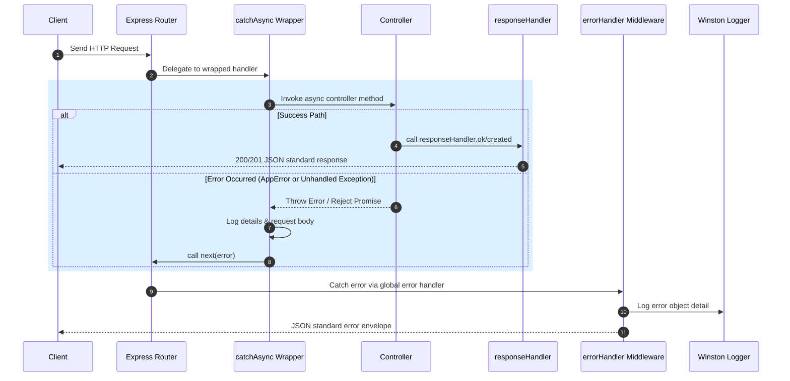

# API Response, Error Handling, and Async Standards

This document establishes the standards, utilities, and middleware architecture used in the `pos-retail` backend to ensure uniform API response envelopes, error tracking, and async handler wrapper patterns.

---

## 🔄 Lifecycle of a Request / Response Flow



---

## ⚡ Asynchronous wrapper: `catchAsync`

To prevent boilerplate `try-catch` structures inside controller handlers, the API utilizes a wrapper function.

* **File Location**: [catchAsyc.ts](file:///Users/hari/Documents/pos-retail/backend/src/utils/catchAsyc.ts)
* **Code Definition**:
  ```typescript
  export const catchAsync =
    (fn: any) => (request: Request, response: Response, next: NextFunction) => {
      Promise.resolve(fn(request, response, next)).catch((error: Error) => {
        console.error("Error caught in catchAsync:", error);
        console.log("request body =>", request.body);
        next(error);
      });
    };
  ```

### How it Works
1. Wraps any asynchronous Express middleware or controller function.
2. If the promise is rejected or an exception is thrown, it captures the error.
3. It prints console logs detailing the error name and outputs the incoming raw JSON `request.body`.
4. It calls `next(error)` to bubble the error up to the global error middleware handler.

### Example Router Integration
```typescript
import { Router } from "express";
import { catchAsync } from "../../utils/catchAsyc";
import { getProductDetail } from "./controller";

const router = Router();
router.get("/:id", catchAsync(getProductDetail));
```

---

## 🟢 API Success Response Standards

All successful endpoints must return standard JSON response envelopes managed by the `responseHandler` helper object.

* **File Location**: [responeHandler.ts](file:///Users/hari/Documents/pos-retail/backend/src/utils/responeHandler.ts)

### 1. HTTP 200 OK
Used for successful reads, updates, and deletes.
* **Helper Method**: `responseHandler.ok<T, M>(res, data, message, meta?)`
* **JSON Payload Envelope**:
  ```json
  {
    "status": "success",
    "message": "success",
    "data": { ... },
    "meta": null
  }
  ```

### 2. HTTP 201 Created
Used for successful resource creations.
* **Helper Method**: `responseHandler.created<T>(res, data, message?)`
* **JSON Payload Envelope**:
  ```json
  {
    "status": "success",
    "message": "created",
    "data": { ... }
  }
  ```

---

## 🔴 API Error Standards

Errors are structured through predefined `ErrorCode` mappings to prevent leaking raw system logs to API clients.

* **Definitions File**: [interface.ts](file:///Users/hari/Documents/pos-retail/backend/src/utils/interface.ts)

### Standard Error Payload
All REST endpoint failures resolve to this structure:
```json
{
  "status": "error",
  "code": "ERROR_CODE_STRING",
  "message": "Human readable description of the error."
}
```

### Predefined Error Codes Matrix
| Error Code | HTTP Status | Default Message |
| :--- | :--- | :--- |
| `BAD_REQUEST` | `400` | Bad Request |
| `UNAUTHORIZED` | `401` | Unauthorized |
| `FORBIDDEN` | `403` | Forbidden |
| `NOT_FOUND` | `404` | Not Found |
| `METHOD_NOT_ALLOWED` | `405` | Method Not Allowed |
| `CONFLICT` | `409` | Conflict |
| `INTERNAL_SERVER_ERROR` | `500` | Internal Server Error |
| `TOO_MANY_REQUESTS` | `429` | Too Many Requests |
| `SERVICE_UNAVAILABLE` | `503` | Service Unavailable |
| `LOCATION_TRANSFER_CROSS_WAREHOUSE_NOT_ALLOWED` | `400` | Inter-warehouse moves are not allowed. Movements must occur within the same warehouse. |

---

## 🛠️ The Global Error Handler & `AppError`

### 1. The `AppError` Custom Class
Used to throw operational errors within controllers and services. Extending the base `Error` class, it binds custom HTTP statuses and application error codes:

* **Definition Location**: [errorHandler.ts](file:///Users/hari/Documents/pos-retail/backend/src/utils/errorHandler.ts#L45-L55)
* **Code Example**:
  ```typescript
  export class AppError extends Error {
    public readonly code: ErrorCode;
    public readonly httpStatus: number;

    constructor(errorCode: ErrorCode, message: string) {
      super(ERROR_CODE[errorCode].message);
      this.message = message ?? ERROR_CODE[errorCode].message;
      this.code = ERROR_CODE[errorCode].code as ErrorCode;
      this.httpStatus = ERROR_CODE[errorCode].httpStatus;
    }
  }
  ```

### 2. Global Error Handler Middleware
This middleware is registered at the very bottom of [app.ts](file:///Users/hari/Documents/pos-retail/backend/src/app.ts#L85) (after all routes). It acts as the catch-all filter.

* **File Location**: [errorHandler.ts](file:///Users/hari/Documents/pos-retail/backend/src/utils/errorHandler.ts#L5-L43)

```typescript
export const errorHandler: ErrorRequestHandler = (
  err: AppError | Error,
  req: Request,
  res: Response,
  next: NextFunction,
) => {
  // Scenario A: Custom operational AppErrors (defined above)
  if (err instanceof AppError) {
    const response: ApiResponse<null, null> = {
      status: "error",
      code: err.code,
      message: err.message,
    };
    logger.error(response);
    return res.status(err.httpStatus).json(response);
  }

  // Scenario B: JSON formatting issues from the parser
  if (
    err instanceof SyntaxError &&
    "status" in err &&
    err.status === 400 &&
    "body" in err
  ) {
    const response: ApiResponse<null, null> = {
      status: "error",
      code: ERROR_CODE.BAD_REQUEST.code,
      message: "Invalid JSON format",
    };
    logger.error(response);
    return res.status(ERROR_CODE.BAD_REQUEST.httpStatus).json(response);
  }

  // Scenario C: Generic runtime exceptions (DB faults, type errors)
  const response: ApiResponse<null, null> = {
    status: "error",
    code: (ERROR_CODE?.INTERNAL_SERVER_ERROR?.code as ErrorCode) || "INTERNAL_SERVER_ERROR",
    message: err?.message || ERROR_CODE?.INTERNAL_SERVER_ERROR?.message || "Internal Server Error",
  };
  logger.error(response);
  res.status(ERROR_CODE?.INTERNAL_SERVER_ERROR?.httpStatus || 500).json(response);
};
```

### Key Responsibilities of the Global Error Handler:
1. **Safety**: Keeps stack traces hidden from external clients during generic 500 runtime exceptions.
2. **Unified Client Delivery**: Wraps every error output format into the identical `ApiResponseError` format (`status`, `code`, `message`).
3. **Structured Server Logging**: Logs all intercepted errors to the server filesystem (e.g. log output logs) using the centralized Winston [logger](file:///Users/hari/Documents/pos-retail/backend/src/utils/logger.ts).
