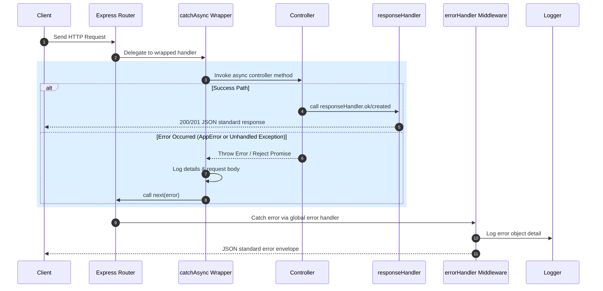

# API Response, Error Handling, and Async Standards

This document establishes the standards, utilities, and middleware architecture used in the `consession` backend to ensure uniform API response envelopes, error tracking, and async handler wrapper patterns.

---

## 🔄 Lifecycle of a Request / Response Flow



---

## ⚡ Asynchronous wrapper: `catchAsync`

To prevent boilerplate `try-catch` structures inside controller handlers, the API utilizes a wrapper function.

* **File Location**: [`src/utils/catchAsync.ts`](file:///Users/hari/Documents/planet-cinema/project/consession/backend/src/utils/catchAsync.ts)
* **Code Definition**:
  ```typescript
  export const catchAsync =
    (fn: any) => (request: Request, response: Response, next: NextFunction) => {
      Promise.resolve(fn(request, response, next)).catch((error: Error) => {
        console.error("Error caught in catchAsync:", error);
        console.log("request body =>", request.body);
        next(error);
      });
    };
  ```

---

## 📦 Standard Success Envelope

All API success responses follow the JSend-compliant structure:
```json
{
  "status": "success",
  "data": { ... },
  "message": "Operation completed successfully",
  "pagination": null
}
```

---

## 🛑 Standard Error Envelope

```json
{
  "status": "error",
  "code": "BAD_REQUEST",
  "message": "Descriptive error message",
  "timestamp": "2026-08-27T18:00:00.000Z"
}
```
